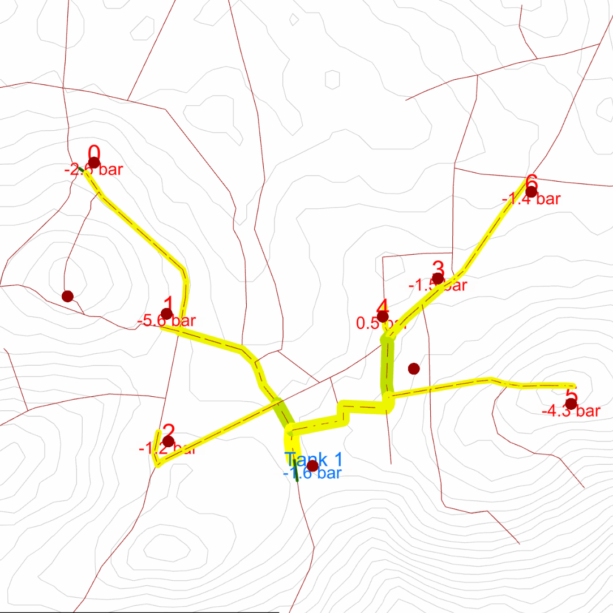

# Pressurised Water Network Analysis

**Access to clean and fresh water is a basic requirement for a healthy city.** Storage and distribution can happen in many ways and it affects the social and spatial structure of a city. Pressurised water networks are a common way to provide access. With the software EPANET these networks can be calculated in an efficient way and allow comparison of different distribution layouts.

## Setup

* **Consumers**

  By opening a tap, water is being consumed. Consumption can be measured in Liters Per Second. But water only flows when the pressure at the tap is high enough (at least 1,5 bar). Pressure is defined by a force acting upon an area. The main force acting upon water is gravity, it normally flows downward. Therefore, the easiest way to increase water pressure is to expand the height difference water has to flow down or use pumps.

* **Storage**

  From clay-pots to wells to artificial lakes as reservoirs the size of the storage defines how much water is available as well as how resilient the water system is against leakage. In the best case multiple storages of different sizes are available and can be refilled.
  Pressurised water systems mainly store water in high altitudes, since it increases water pressure through gravity. Reservoirs are normally found in mountainous areas and water tanks in towers. However, one has to consider that water towers only have a limited volume. Decreasing the volume also reduces the water pressure.

* **Pipe Network**

  Pipes transport the water from storage to consumers. But their properties such as diameter and roughness define how fast water flows through the pipes and with it the pressure at consuming nodes. (A glass is easier/with less pressure to empty than a bottle, since it has a greater area than the bottleneck.)
  A reference value for the velocity of water in a pipe is around 2 m/s. Below it, the pressure might be too low and water might age in the pipes leading to bad taste.
  Pipe networks are dependent on physics, too. Water flowing downwards form a reservoir cannot climb above it without the help of pumps.

* **Pumps**

  Pressurised water systems might be able to work with gravity only. Having a storage in high altitude, consumers below it and a defined water demand, the system can work constantly. But demands might change or the storage might deplete. Pumps can increase water pressure and push it through pipes. They can push water from a well up the hill to fill the storage, too.

## Application

The precision of a water analysis depends on the phase of planning. In an early stage the use of software such as EPANET is not required. Normally, it is straightforward to place water storage at high altitudes while considering the water source (rain, well). Consuming nodes should be placed at least 15 meter below the tanks to gain the minimum water pressure of around 1.5bar.

When distribution layouts need to be planned, a basic configuration for EPANET can be used to compare layouts (see DeCodingSpaces Toolbox) and when a decision for a good one is made, it can be calculated precisely.

Pipe networks are normally placed below streets as public property and infrastructure arteries. It is recommended to consider hierarchies of taps and looping in this step (see limitations), since they affect the social, spatial structure and resilience of the network.

## Limitations

* Pipes in pressurised water networks can leak leading to faster discharge of reservoirs. Furthermore, consumers might suffer from missing water. Redundancies such as loops in the pipe layout can therefore prevent water outage, but require more investment.

* Pressurised water networks are sensitive to changing demands, since pipe diameters and physics define how much can be consumed and not the other way around. This is especially an issue in growing and shrinking cities. Pumps can compensate ups and downs, but require energy. Introducing hierarchies in consuming nodes can help, such as public taps that will be extended in the future to private taps, when demand is more stable.

* Provision of taps for consumers might lead to irresponsible water usage, since the storage volume is most of the time invisible while consuming.
