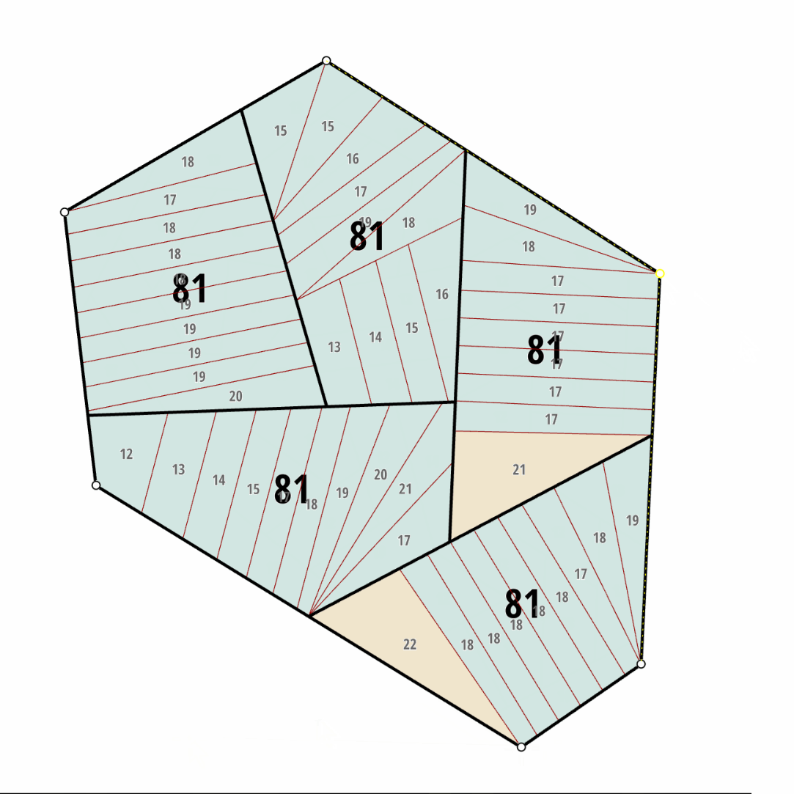

# Divide By Area

Divides a polygon in predefined areas. Useful to create parcels of specific area on a street blocks.

## Setup

* **Division**
  
  Needs a boundary polygon as well as a list of sqm-values to divide polygon. The algorithm creates step by step new polygons inside the boundary with the specified areas. However, there are multiple options to add a polygon, since it can be created at each side of the boundary. The algorithm tests each option and chooses the best one according to its evaluation criteria.

* **Evaluation criteria**

  Depending on the evaluation criteria the outcome can have different results. I.e. a criteria can be, that the edges of the new polygons always try to align to a given direction, leading to a more linear parcellation. Another criteria could choose the area with the widest width, the result often looks like a rose.

## Application

* Fast parcellation of street blocks. Narrow street blocks can be easily subdivided in exact areas, providing a fair distribution of parcels. Wider street blocks can be subdivided, too, but not every parcel might have access to streets. A combination with [Slicing Tree Module]() is possible.

## Limitations

* Area is in control, but the resulting shape of the parcels can be unsatisfying, because they might be too narrow or not attached to the boundary polygon.
