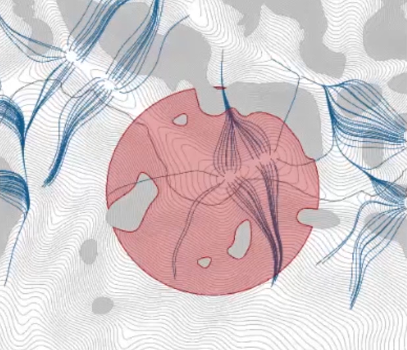

# Flowlines

When water runs down a hill it is pulled by gravity leading it the fastest and easiest way downwards, mainly the steepest path. This principle can be translated to other topics such as walking paths.
Starting from the highest point, flowlines to all other points can be traced following the easiest path.

## Setup

* Starting with a topography as a mesh derived i.e. from a greyscale image or online resources, the algorithm searches for the highest point. In the standard mode it finds the steepest neighbour point and draws a line between both points. It continues until all points have been passed. The resulting paths are the flowlines of i.e. water.

* The algorithm can be adapted to find i.e. the flattest neighbour leading to paths similar to the contour lines of the terrain.

## Application

The topography can be a terrain, but it can also represent a map of interest, with mountains as the most important places: on a cone all paths would lead to the top.

Normally used for water rundown, the paths can also be a base for streets, following the water direction. Or if the topography would represent the closeness to forest, it would trace the fastest paths towards forest.

If used with i.e. flattest path, the result might be serpentine like lines up the hill.

## Limitations

* Water rundown calculations might show location of rivers at different place than on-site. The precision of the calculation depends on the resolution of the grid as well of the topography. It is a matter of available data and computing power that does not allow a fully precise calculation.

* The used flowlines calculation provides fast results. Alternatively, agent-based approaches might provide more precise but slower calculations.
