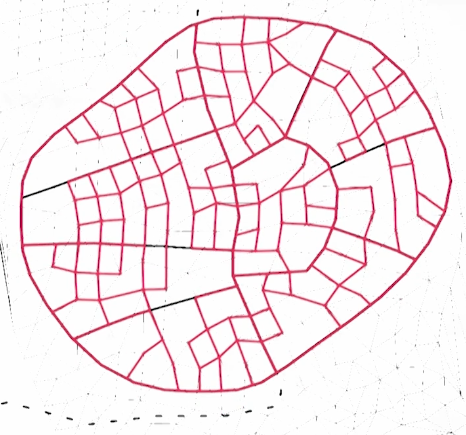

# Quadrangulation

A distribution of points can be connected through quadrangulation, meaning four points are always connected by lines with no other line between them. This results in a pattern of quads, that could suit i.e. as blocks.

## Setup

In combination with i.e. [force-based distribution]() points can be distributed over an area. Delaunay Triangulation draws lines between the points resulting in a triangle pattern. By pairing triangles and removing their diagonale they can be transformed into quads.

## Application

* Points could be distributed according to the terrain or existing streets. Through quadrangulation, quads representing blocks can be drawn. The resulting blocks are derived from the point distribution and therefore orient themselves to the terrain and existing streets.

* By combining quads, bigger blocks can be created.

## Limitations

* Controlling of sizes and orientation of quads can be difficult.