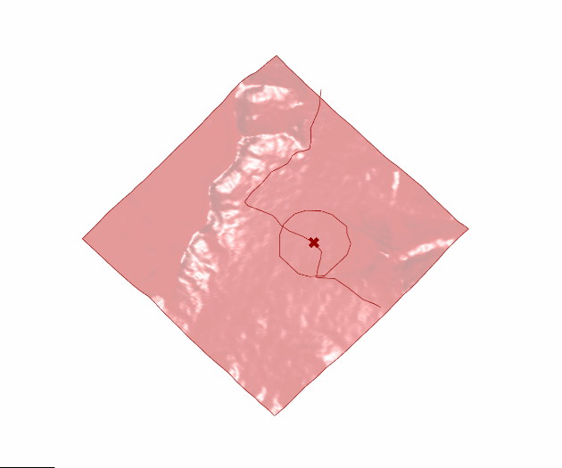
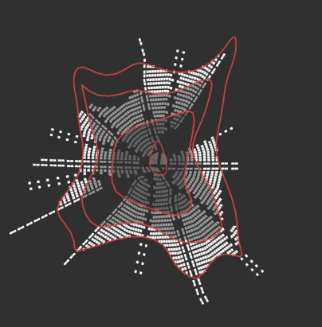

# Boundary

|  |  |

Creates a context-aware boundary of predefined size.

## Setup

This module makes use of the [Evaluation Score Module]().

* Underlying points, each representing a defined sqm-area, are evaluated for factors such as terrain slope or closeness to streets. The points are sorted according to their score. - A point grid is easiest to handle, since each point occupies the same area.

* By setting a **sqm-size** that the boundary should occupy, the algorithm chooses the needed amount of points starting with the one with the best score. Afterwards a boundary is drawn around the outer laying points.

## Application

The algorithm can be used to define city, quarter or plot boundaries. The boundary can be used as a ring street.
It can be combined with itself either by i.e. creating multiple ring roads or by subtracting after each iteration the used points. In this way boundaries do not cross each other and grow like cells see [Growing Boundaries]().

## Limitations

* The accuracy of the algorithm sometimes leads to unwanted results such as holes in the boundary.
